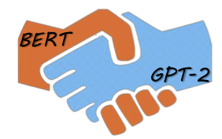
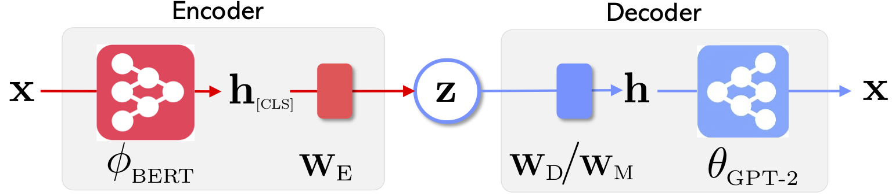
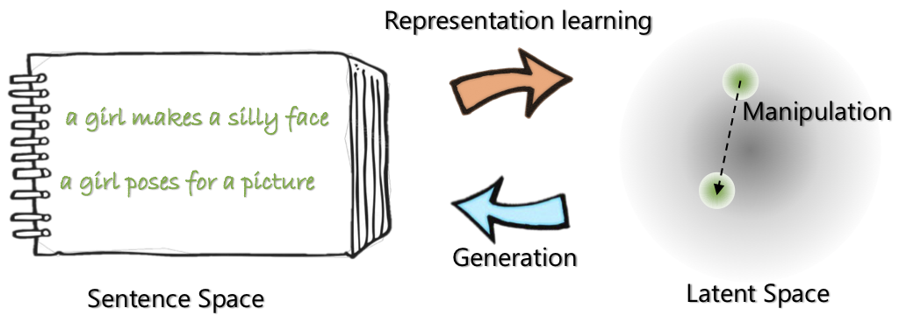

# Optimus: the first pre-trained Big VAE language model   
 
This repository contains source code necessary to reproduce the results presented in the EMNLP 2020 paper [Optimus: Organizing Sentences via Pre-trained Modeling of a Latent Space](https://arxiv.org/abs/2004.04092).


| |  
|-------------------------|:-------------------------:|
| The network architecture of Optimus: encoder for representation learning and decoder for generation | Sentences are organized and manipulated in a pre-trained compact and smooth latent space 


For more on this project, see the [Microsoft Research Blog post](https://www.microsoft.com/en-us/research/blog/a-deep-generative-model-trifecta-three-advances-that-work-towards-harnessing-large-scale-power/).


## News

May 21, 2020: Releasing a [`demo`](http://40.71.23.172:8899/) for latent space manipulation, including sentence interpolation and analogy. Check out the [`website`](http://40.71.23.172:8899/).

May 20, 2020: The latent space manipulation code is cleaned and released. See instructions at [`optimius_for_snli.md`](doc/optimius_for_snli.md).

May 13, 2020: The fine-tuning code for langauge modeling is released. See instructions  at [`optimus_finetune_language_models.md`](doc/optimus_finetune_language_models.md)

## Contents
There are four steps to use this codebase to reproduce the results in the paper.

1. [Dependencies](#dependencies)
2. [Prepare datasets](#prepare-datasets)
3. [Model training](#Model-training)
    1. Pre-training on setences in Wikipedia
    2. Languange Modeling
    3. Guided Language Generation
    4. Low-resource Language Understanding
4. [Collect and plot results](#collect-and-plot-results)


## Dependencies

Pull docker from Docker Hub at: `chunyl/pytorch-transformers:v2`. Please see the instruction at [`doc/env.md`](doc/env.md)

The project is organized into the following structures, with ensential files & folders visualized.  `output` saves the models checkpoints.
```
├── Optimus
   └── code
       ├── examples
           ├── big_ae
               ├── modules
                   ├── vae.py
                   └── ...
               ├── run_lm_vae_pretraining_phdist_beta.py
               ├── run_lm_vae_training.py
               └── ...
	   ├── pytorch_transformers
               ├── modeling_bert.py
               ├── modeling_gpt2.py
               └── ...
       ├── scripts
           ├── scripts_docker
	   ├── scripts_local
	   ├── scripts_philly
   └── data
       └── datasets
           ├── wikipedia_json_64_filtered
               └── ...
	   ├── snli_data
           └── ...
   └── output
       ├── pretrain
       ├── LM
       └── ...       
```

## Prepare Datasets

Please download or preparation the data via following the instructions at [`data/download_datasets.md`](data/download_datasets.md). 

## Model Training

**1. Pre-training on setences in Wikipedia**

We pre-trained our models on Philly (a Microsoft internal compute cluster), the code is specialized for multi-node multi-GPU compute on this platform. The pre-training main python is [`run_lm_vae_pretraining_phdist_beta.py`](code/examples/big_ae/run_lm_vae_pretraining_phdist_beta.py). You may need to adjust the distributed training scripts. 

**2. Languange Modeling**

To have a fair comparison with existing VAE languange models, we consider a model with latent dimension 32. The pre-trained model is fine-tuned on four commonly datasets for one epoch. Please see the details at [`doc/optimus_finetune_language_models.md`](doc/optimus_finetune_language_models.md)

**3. Guided Language Generation**


**Latent Space Manipulation** To ensure good performance, we consider a model with latent dimension 768. The pre-trained model is fine-tuned on SNLI dataset, where sentences show related patterns. Please see the details at 
Please see the details at [`doc/optimius_for_snli.md`](doc/optimius_for_snli.md)

**4. Low-resource Language Understanding**

## Collect and Plot Results

Once the networks are trained and the results are saved, we extracted key results using Python script. The results can be plotted using the included IPython notebook `plots/main_plots.ipynb`.
Start the IPython Notebook server:

```
$ cd plots
$ ipython notebook
```

Select the `main_plots.ipynb` notebook and execute the included
code. Note that without modification, we have copyed our extracted results into the notebook, and script will output figures in the paper. If you've run your own training and wish to plot results, you'll have to organize your results in the same format instead.


## Questions?

Please drop me ([Chunyuan](http://chunyuan.li/)) a line if you have any questions.


```
@inproceedings{li2020_Optimus,
  title={Optimus: Organizing Sentences via Pre-trained Modeling of a Latent Space},
  author={Li, Chunyuan and Gao, Xiang and Li, Yuan and Li, Xiujun and Peng, Baolin and Zhang, Yizhe and Gao, Jianfeng},
  booktitle={EMNLP},
  year={2020}
}
```


